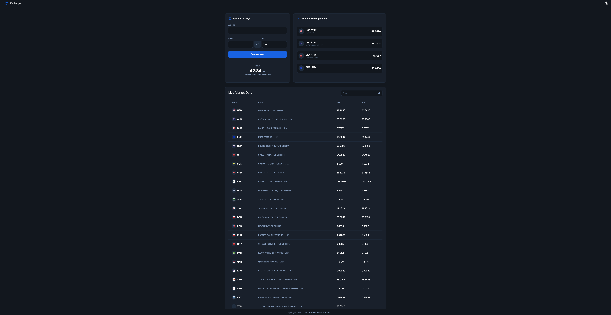
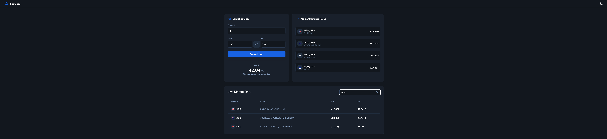
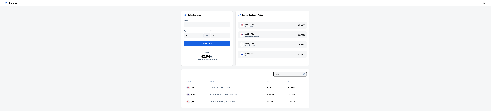
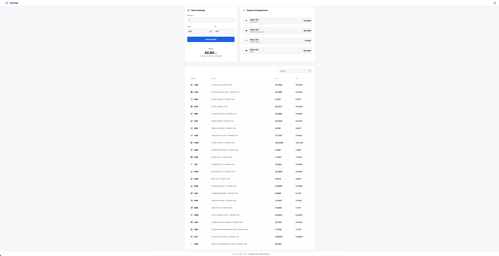

# ENGLISH
# 💱 TCMB Exchange Rate Tracker

A full-stack web application that tracks real-time exchange rates using data from the Central Bank of the Republic of Turkey (TCMB). Built with **TypeScript** on both frontend and backend.

## 🚀 Features

- **TCMB Integration:** Daily exchange rate data fetched directly from TCMB services.
- **Data Transformation:** XML data from TCMB is converted to JSON format on the backend for optimized delivery.
- **Currency Converter:** Dynamic calculation tool based on Turkish Lira (TRY).
- **Popular Rates:** Quick-view panel for the most frequently traded currencies.
- **Rates Table:** Comprehensive table listing all available exchange rates in detail.
- **🌓 Light/Dark Mode:** Full support for both light and dark themes for a better user experience.
- **Responsive Design:** Modern, mobile-friendly interface built with TailwindCSS.

## 🛠️ Tech Stack

### Frontend
- **React** (TypeScript)
- **TailwindCSS** (Styling)
- **Vite** (Build Tool)

### Backend / API
- **Node.js** & **Express.js** (TypeScript)
- **XML2JS** (XML'den JSON'a dönüşüm için)

## 📦 Installation & Setup

Follow these steps to run the project on your local machine:

1. **Clone the Repository:**
   ```bash
   git clone [https://github.com/leventkoman/exchange.git](https://github.com/leventkoman/exchange.git)
   cd exchange
2. **Install Dependencies:**
   ```bash
   npm install
3. **Start the Application:**
   ```bash
   npm run dev   
> **Note:**   
> By default, the project uses the TypeScript-based Express.js server. If you prefer to use a different backend setup (like a plain Node.js server), you can modify the dev:api script in the package.json file:
---
# TÜRKÇE
# 💱 TCMB Exchange Rate Tracker

Bu proje, Türkiye Cumhuriyeti Merkez Bankası (TCMB) verilerini kullanarak güncel döviz kurlarını takip etmenizi sağlayan, full-stack bir web uygulamasıdır. Proje hem frontend hem de backend tarafında **TypeScript** ile geliştirilmiştir.

## 🚀 Özellikler

- **TCMB Entegrasyonu:** Günlük kur bilgileri doğrudan TCMB servislerinden çekilir.
- **Veri Dönüştürme:** TCMB'den gelen XML formatındaki veriler, backend üzerinde JSON formatına dönüştürülerek optimize edilir.
- **Döviz Çevirici:** Türk Lirası (TL) tabanlı dinamik hesaplama aracı.
- **Popüler Kurlar:** En çok işlem gören para birimleri için hızlı bakış paneli.
- **Kur Tablosu:** Tüm döviz kurlarının detaylı listelendiği kapsamlı tablo.
- **🌓 Light/Dark Mode**: Kullanıcı deneyimini artırmak amacıyla açık ve koyu tema seçenekleri için tam destek.
- **Responsive Tasarım:** TailwindCSS ile mobil uyumlu modern arayüz.

## 🛠️ Teknolojiler

### Frontend
- **React** (TypeScript)
- **TailwindCSS** (Styling)
- **Vite** (Build Tool)

### Backend / API
- **Node.js** & **Express.js** (TypeScript)
- **XML2JS** (XML'den JSON'a dönüşüm için)

## 📦 Kurulum ve Çalıştırma

Projeyi yerel makinenizde çalıştırmak için aşağıdaki adımları izleyin:

1. **Repoyu Klonlayın:**
   ```bash
   git clone [https://github.com/leventkoman/exchange.git](https://github.com/leventkoman/exchange.git)
   cd exchange
2. **Bağımlılıkları Yükleyin:**
   ```bash
   npm install
3. **Uygulamayı Başlatın:**
   ```bash
   npm run dev   
> **Not:**   
> Eğer Express.js (TS) yerine standart server.js üzerinden ilerlemek isterseniz, package.json içerisindeki dev:api yolunu server.js olarak değiştirmeniz yeterlidir
bu alanı nasıl eklemeliyim



